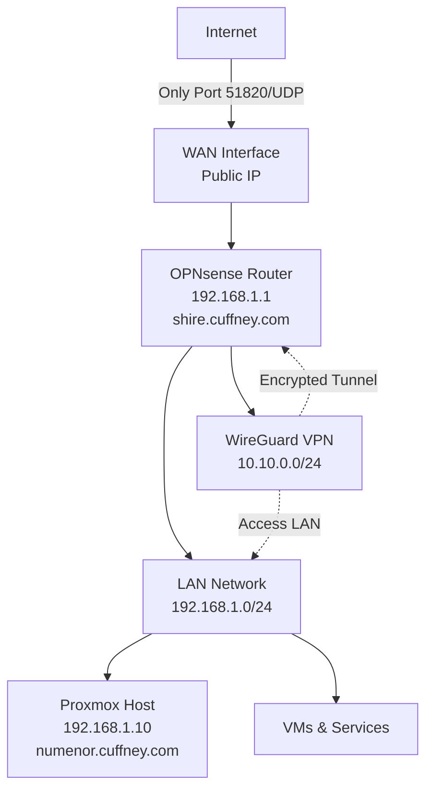

# Homelab Networking Guide

A comprehensive guide to setting up a secure, professional home network with DNS, VPN, and firewall configuration. This guide teaches networking concepts while providing step-by-step instructions you can replicate.

## Table of Contents

1. [Introduction & Network Architecture](#introduction--network-architecture)
2. [Core Networking Concepts](#core-networking-concepts)
3. [Phase 1: DNS Configuration](#phase-1-dns-configuration)
4. [Phase 2: WireGuard VPN Setup](#phase-2-wireguard-vpn-setup)
5. [Phase 3: TLS/SSL Certificates (Optional)](#phase-3-tlsssl-certificates-optional)
6. [Key Takeaways & Best Practices](#key-takeaways--best-practices)

---

## Introduction & Network Architecture

### Overview

This guide walks you through setting up a professional-grade home network with:

- **Centralized DNS** using OPNsense Unbound (local DNS server)
- **Secure remote access** via WireGuard VPN (only public-facing service)
- **Domain-based hostnames** using your own domain (e.g., `cuffney.com`)
- **Zero public exposure** - all services accessible only via VPN or local network

### Network Architecture



### IP Address Ranges

- **LAN Network**: `192.168.1.0/24` (private network)
  - OPNsense: `192.168.1.1`
  - Proxmox: `192.168.1.10`
  - VMs: `192.168.1.11+` (assigned via DHCP or static)
- **VPN Network**: `10.10.0.0/24` (WireGuard VPN)
  - VPN Server: `10.10.0.1`
  - VPN Clients: `10.10.0.2+`
- **Public IP**: Your ISP-assigned public IP (for Route 53 DNS records)

### Security Model

**CRITICAL**: This setup ensures **NO services are exposed to the public internet**. All remote access is **ONLY** via WireGuard VPN.

**Access Model:**
- **Local Network (192.168.1.0/24)**: Full access to all services
- **VPN Network (10.10.0.0/24)**: Full access to LAN services when connected via WireGuard
- **Public Internet**: **NO access** to any services except WireGuard VPN port (51820/UDP)

**Security Checklist:**
- ✅ **ONLY port 51820/UDP** is forwarded/exposed to the internet (WireGuard)
- ✅ **NO port forwarding** for HTTP (80), HTTPS (443), Plex (32400), Proxmox (8006), or any other services
- ✅ **WAN firewall rules** block all inbound traffic except WireGuard
- ✅ **LAN firewall rules** prevent WAN → LAN access
- ✅ **Services are only accessible** from LAN (192.168.1.0/24) and VPN (10.10.0.0/24)

### Naming Convention

All hosts use **dual naming** (both required):
- **Descriptive names**: `opnsense`, `proxmox`, `ubuntu-vm` (what it is/does)
- **Themed names**: `shire`, `numenor`, `rivendell` (Middle Earth places)
- Both names resolve to the same IP and can be used interchangeably

---

## Core Networking Concepts

Before diving into configuration, let's understand the key networking concepts you'll be working with.

### DNS (Domain Name System)

**What is DNS?**

DNS is like a phone book for the internet. When you type `google.com` in your browser, DNS translates that human-readable name into an IP address like `142.250.191.14` that computers understand.

**How DNS Works:**

1. Your device asks: "What's the IP for `numenor.cuffney.com`?"
2. DNS server responds: "That's `192.168.1.10`"
3. Your device connects to `192.168.1.10`

**Why We Use Unbound (Local DNS Server):**

- **Local Control**: You control DNS for your internal network
- **Custom Hostnames**: Create friendly names like `numenor.cuffney.com` instead of remembering IPs
- **Privacy**: DNS over TLS encrypts queries to upstream DNS servers
- **Performance**: Local caching speeds up repeated lookups
- **Security**: DNSSEC validates DNS responses haven't been tampered with

**DNS Flow in Our Setup:**

```
Device → OPNsense Unbound → [Encrypted TLS] → Cloudflare DNS
         (Local cache)      (DNS over TLS)   (1.1.1.1:853)
```

### DHCP (Dynamic Host Configuration Protocol)

**What is DHCP?**

DHCP automatically assigns IP addresses to devices when they connect to your network. Instead of manually configuring each device, DHCP handles it automatically.

**How DHCP Works:**

1. Device connects to network: "I need an IP address!"
2. DHCP server responds: "Here's IP `192.168.1.50`, use DNS server `192.168.1.1`, and your search domain is `cuffney.com`"
3. Device configures itself automatically

**Static IP vs Dynamic IP:**

- **Dynamic IP (DHCP)**: Device gets a random IP from a pool (e.g., `192.168.1.100-200`). IP might change if device disconnects.
- **Static IP (DHCP Reservation)**: Device always gets the same IP (e.g., Proxmox always gets `192.168.1.10`). Configured via DHCP reservations.

**When to Use Static IPs:**

Use static IPs (via DHCP reservations) for:
- **Servers** (Proxmox, OPNsense) - need consistent IPs
- **Services** that other devices depend on
- **DNS entries** - DNS records point to specific IPs

Use dynamic IPs for:
- **Laptops, phones, tablets** - devices that come and go
- **Guest devices** - temporary connections

**How DHCP Reservations Work:**

A DHCP reservation tells the DHCP server: "When device with MAC address `AA:BB:CC:DD:EE:FF` asks for an IP, always give it `192.168.1.10`."

This gives you the best of both worlds:
- Device still uses DHCP (automatic configuration)
- Device always gets the same IP (predictable, works with DNS)

### FQDN vs Short Hostnames

**FQDN (Fully Qualified Domain Name):**
- Full domain name: `numenor.cuffney.com`
- Always works, no ambiguity
- Required for DNS records

**Short Hostname:**
- Just the hostname: `numenor`
- Shorter to type
- Requires a "search domain" to work

**Search Domains:**

A search domain is a convenience feature that automatically appends a domain to short hostnames.

**Example with search domain `cuffney.com`:**
```bash
# You type:
ssh jcuffney@numenor

# System automatically tries:
numenor.cuffney.com  # ✅ Works!
```

**Without search domain:**
```bash
# You type:
ssh jcuffney@numenor

# System doesn't know what "numenor" means - might fail ❌
```

**Benefits:**
- **Shorter Commands**: `ssh numenor` instead of `ssh numenor.cuffney.com`
- **Less Typing**: `ping shire` instead of `ping shire.cuffney.com`
- **Consistent Experience**: Same short hostnames work across all devices

### Firewall Rules

**What is a Firewall?**

A firewall is like a security guard for your network. It decides what traffic is allowed in and out.

**How Firewall Rules Work:**

Firewall rules are evaluated in order (top to bottom). The first matching rule wins.

**Rule Components:**
- **Action**: `Pass` (allow) or `Block` (deny)
- **Interface**: Which network interface (WAN, LAN, WireGuard)
- **Source**: Where traffic comes from
- **Destination**: Where traffic goes to
- **Protocol/Port**: What type of traffic (TCP, UDP, specific ports)

**WAN vs LAN Rules:**

- **WAN Rules**: Control traffic from the internet (inbound)
  - Example: Allow WireGuard (port 51820) from internet
  - Example: Block everything else from internet
  
- **LAN Rules**: Control traffic on your local network
  - Example: Allow all LAN devices to access internet
  - Example: Allow VPN clients to access LAN

**Rule Ordering Matters:**

Rules are evaluated top to bottom. Once a rule matches, processing stops.

**Example:**
```
Rule 1: Allow WireGuard (port 51820) from WAN → PASS ✅
Rule 2: Block all traffic from WAN → BLOCK ❌
```

If WireGuard rule is first, it matches and traffic is allowed. If block rule is first, WireGuard traffic gets blocked.

### NAT (Network Address Translation)

**What is NAT?**

NAT translates between private IP addresses (your internal network) and public IP addresses (the internet).

**Why We Need NAT:**

- Your LAN uses private IPs: `192.168.1.0/24`
- Internet uses public IPs: `38.49.92.238` (your ISP-assigned IP)
- NAT translates: `192.168.1.50` → `38.49.92.238` when accessing internet

**How NAT Works:**

```
Device (192.168.1.50) → OPNsense (NAT) → Internet (38.49.92.238)
```

When you visit `google.com`:
1. Your device (`192.168.1.50`) sends request
2. OPNsense translates source IP to public IP (`38.49.92.238`)
3. Google sees request from `38.49.92.238`
4. Response comes back to `38.49.92.238`
5. OPNsense translates back to `192.168.1.50`
6. Your device receives response

**NAT for VPN Clients:**

VPN clients (`10.10.0.0/24`) also need NAT to access the internet:
- VPN client (`10.10.0.2`) wants to visit `google.com`
- OPNsense translates to public IP (`38.49.92.238`)
- Google sees request from your public IP
- Response comes back, OPNsense routes to VPN client

### VPN (Virtual Private Network)

**What is a VPN?**

A VPN creates an encrypted tunnel between your device and your home network, allowing you to securely access your network from anywhere.

**WireGuard Basics:**

WireGuard is a modern, fast VPN protocol. It uses:
- **Key pairs**: Public/private keys for authentication (like SSH keys)
- **Tunnel addresses**: VPN clients get IPs on a separate network (`10.10.0.0/24`)
- **Encryption**: All traffic is encrypted

**Split Tunnel vs Full Tunnel:**

- **Split Tunnel**: Only traffic to your home network routes through VPN
  - `192.168.1.0/24` → VPN
  - Internet → Direct connection (faster)
  
- **Full Tunnel**: All traffic routes through VPN
  - Everything → VPN (more secure, but slower)

**VPN Traffic Flow:**

```
Remote Device → WireGuard VPN (Encrypted) → OPNsense → LAN Services
```

### DNS Overrides vs Public DNS Records

**DNS Overrides (Unbound - Local DNS):**
- Stored in OPNsense Unbound
- Used by devices on your local network
- Point to **private IPs**: `numenor.cuffney.com` → `192.168.1.10`
- Fast, local, private

**Public DNS Records (Route 53):**
- Stored in AWS Route 53
- Used by external devices (VPN clients, internet)
- Point to **public IP**: `numenor.cuffney.com` → `38.49.92.238`
- Allows external access via domain name

**Why We Need Both:**

- **Local devices** query Unbound → get private IP (`192.168.1.10`) → direct connection ✅
- **VPN clients** query Route 53 → get public IP (`38.49.92.238`) → connect via VPN ✅

Both resolve the same domain name, but to different IPs depending on where you're querying from.

---

## Phase 1: DNS Configuration

This phase sets up DNS so you can use friendly hostnames like `numenor.cuffney.com` instead of IP addresses.

### 1.1 Verify Unbound DNS is Enabled

**What We're Doing:**

Unbound is OPNsense's built-in DNS server. We're verifying it's enabled and ready to use.

**Steps:**

1. Access OPNsense Web UI: `https://192.168.1.1`
2. Navigate to: **Services → Unbound DNS → General**
3. Verify **Enable Unbound** checkbox is checked
4. Verify **Listen Port** is `53` (default DNS port)
5. Click **Save** if any changes were made

**Test:**
```bash
# From any device on your network
dig @192.168.1.1 google.com
# Should return DNS results
```

**Expected Result**: DNS queries to OPNsense should resolve.

### 1.2 Configure Unbound DNS Settings

**What We're Doing:**

Configuring Unbound with security and privacy features:
- **DNSSEC**: Validates DNS responses haven't been tampered with
- **DNS over TLS**: Encrypts DNS queries to upstream servers (prevents ISP from seeing what sites you visit)

**Steps:**

1. In OPNsense: **Services → Unbound DNS → General**
2. Configure:
   - **Network Interfaces**: Select LAN interface
   - **Enable DNSSEC**: ✅ (check this)
   - **Enable DNS over TLS**: ✅ (optional, recommended)
   - **Enable Unbound Control**: ✅ (for management)
3. Click **Save**
4. Click **Apply Changes**

5. Configure DNS over TLS Custom Forwarding:
   - Navigate to: **Services → Unbound DNS → DNS over TLS** (or find the DNS over TLS tab)
   - Ensure **"Use system nameservers"** is **unchecked**
   - Ensure **"Custom Forwarding"** is **selected**
   - Click **Add** to create first entry (Cloudflare Primary):
     - **Enabled**: ✅ Check this
     - **Domain**: (leave empty, or `cloudflare-dns.com` if required)
     - **Server IP**: `1.1.1.1`
     - **Server Port**: `853`
     - **Forward first**: (leave unchecked)
     - **Verify CN**: `cloudflare-dns.com` (text field - verifies certificate)
     - **Description**: `Cloudflare DNS (Primary)`
   - Click **Save**
   
   - Click **Add** to create second entry (Cloudflare Secondary):
     - **Enabled**: ✅ Check this
     - **Domain**: (leave empty, or `cloudflare-dns.com` if required)
     - **Server IP**: `1.0.0.1`
     - **Server Port**: `853`
     - **Forward first**: (leave unchecked)
     - **Verify CN**: `cloudflare-dns.com` (text field - verifies certificate)
     - **Description**: `Cloudflare DNS (Secondary)`
   - Click **Save**
6. Click **Apply Changes**

**Test:**
```bash
# Test DNS resolution
dig @192.168.1.1 google.com
# Should work with DNSSEC validation
```

**Expected Result**: DNS resolution works with DNSSEC enabled.

### 1.3 Configure DHCP to Use Unbound

**What We're Doing:**

Making all devices on your network use OPNsense as their DNS server. This ensures all devices use your local DNS (with custom hostnames) and encrypted DNS queries.

**Steps:**

1. In OPNsense: **Services → ISC DHCPv4 → [LAN]**
   - **Note**: Use "ISC DHCPv4" (not "DHCPv4" or "Unbound DNS")
2. Scroll to **DNS Servers** section
3. Configure (only 2 DNS server fields available):
   - **Primary DNS**: `192.168.1.1` (OPNsense/Unbound)
   - **Secondary DNS**: `1.1.1.1` (Cloudflare fallback)
4. Scroll to **Domain** or **Domain Name** field
5. Set **Domain**: `cuffney.com` (this sets the search domain)
6. Click **Save**
7. Restart the DHCP service to apply changes:
   - Navigate to: **Services → ISC DHCPv4**
   - Click **Restart** button (or **Stop** then **Start**)
   - **Note**: There is no "Apply Changes" button - restarting the service applies the changes

**Test:**
```bash
# On a device that gets IP via DHCP

# Linux/Unix: Check DNS configuration
cat /etc/resolv.conf
# Should show: nameserver 192.168.1.1
# Should show: search cuffney.com

# macOS: Check DNS configuration (macOS doesn't use /etc/resolv.conf)
scutil --dns
# Look for resolver #1 - should show nameserver[0] or nameserver[1] as 192.168.1.1
# Also verify search domain is set (e.g., cuffney.com)

# Test DNS resolution (works on both Linux and macOS)
nslookup google.com
# Should resolve successfully
```

**Expected Result**: DHCP clients use OPNsense as DNS server and have search domain configured.

### 1.4 Configure Static IP Addresses (DHCP Reservations)

**What We're Doing:**

Setting up static IP addresses for servers and critical devices. This ensures they always get the same IP, which is required for DNS entries.

**Why Static IPs Matter:**

- **DNS Entries**: DNS records point to specific IPs. If a device's IP changes, DNS breaks.
- **Service Dependencies**: Other devices/services depend on consistent IPs.
- **Predictability**: Easier to manage and troubleshoot.

**How DHCP Reservations Work:**

Instead of manually configuring IPs on each device, we use DHCP reservations:
- Device still uses DHCP (automatic configuration)
- DHCP server always assigns the same IP to that device's MAC address
- Best of both worlds: automatic config + predictable IPs

**Steps:**

1. **Find Device MAC Address:**
   - **Proxmox**: SSH into Proxmox and run: `ip link show` or check Proxmox Web UI → System → Network
   - **Other devices**: Check device settings or DHCP leases in OPNsense

2. **Create DHCP Reservation:**
   - In OPNsense: **Services → ISC DHCPv4 → [LAN]**
   - Scroll to **DHCP Static Mappings** section
   - Click **Add** button
   - Configure:
     - **MAC Address**: Device's MAC address (e.g., `AA:BB:CC:DD:EE:FF`)
     - **IP Address**: Desired static IP (e.g., `192.168.1.10` for Proxmox)
     - **Hostname**: Device hostname (e.g., `numenor`)
     - **Description**: Device description (e.g., `Proxmox Host`)
   - Click **Save**
   - Click **Apply Changes**

3. **Release/Renew DHCP Lease:**
   - On the device, release and renew its DHCP lease:
     ```bash
     # Linux
     sudo dhclient -r && sudo dhclient
     
     # macOS
     sudo ipconfig set en0 DHCP
     
     # Or simply reboot the device
     ```

**Example Reservations:**

- **Proxmox**: `192.168.1.10` (MAC: `AA:BB:CC:DD:EE:FF`)
- **OPNsense**: `192.168.1.1` (usually static by default, but verify)
- **VMs**: `192.168.1.11+` (as you create them)

**Test:**
```bash
# On the device with static IP
ip addr show
# Should show the reserved IP address

# From another device
ping 192.168.1.10
# Should reach Proxmox
```

**Expected Result**: Device always gets the same IP address.

### 1.5 Configure Proxmox DNS

**What We're Doing:**

Configuring Proxmox to use OPNsense DNS so it can resolve hostnames and use the search domain.

**Steps:**

1. Access Proxmox Web UI: `https://192.168.1.10:8006`
2. Navigate to: **Datacenter → [Your Node] → System → DNS**
3. Configure DNS servers (one per line):
   ```
   192.168.1.1
   1.1.1.1
   ```
   **Note**: Proxmox allows multiple DNS servers. Two is sufficient (matching OPNsense DHCP configuration). You can optionally add a third:
   ```
   192.168.1.1
   1.1.1.1
   1.0.0.1
   ```
   The third DNS server (`1.0.0.1`) provides additional redundancy but is optional.
4. Configure **Search Domain**: Enter `cuffney.com`
   - This allows Proxmox to use short hostnames (e.g., `shire` instead of `shire.cuffney.com`)
   - Matches the search domain configured in OPNsense DHCP
5. Click **OK**

**Test:**
```bash
# SSH into Proxmox
ssh root@192.168.1.10

# Check DNS configuration
cat /etc/resolv.conf
# Should show: nameserver 192.168.1.1
# Should show: search cuffney.com

# Test DNS resolution
nslookup google.com
dig @192.168.1.1 google.com

# Test search domain (if shire/opnsense DNS override is configured)
nslookup shire
# Should resolve to 192.168.1.1 (using search domain)
```

**Expected Result**: Proxmox uses OPNsense DNS and can resolve domains.

### 1.6 Set Hostname on Proxmox

**What We're Doing:**

Setting the hostname on Proxmox so the system knows its identity. This will be updated to FQDN in a later step.

**Steps:**

1. SSH into Proxmox: `ssh root@192.168.1.10`
2. Set hostname (temporary - will be updated to FQDN later):
   ```bash
   hostnamectl set-hostname numenor
   ```
3. Verify:
   ```bash
   hostnamectl
   # Should show: Static hostname: numenor
   ```

**Test:**
```bash
# Verify hostname
hostname
# Should output: numenor
```

**Expected Result**: Proxmox hostname is set to `numenor` (temporary).

### 1.7 Set Hostname on OPNsense

**What We're Doing:**

Setting the hostname and domain on OPNsense so it knows its identity.

**Steps:**

1. Access OPNsense Web UI: `https://192.168.1.1`
2. Navigate to: **System → Settings → General**
3. Set:
   - **Hostname**: `shire` (Middle Earth naming: OPNsense = shire)
   - **Domain**: `cuffney.com`
4. Click **Save**

**Test:**
```bash
# From OPNsense CLI (if accessible)
hostname
# Should output: shire
```

**Expected Result**: OPNsense hostname is set to `shire` with domain `cuffney.com`.

### 1.8 Update Proxmox Hostname with Domain

**What We're Doing:**

Setting the FQDN hostname on Proxmox. This provides several benefits:
- System identifies itself with full domain name
- SSL/TLS certificates can match hostname
- Logs show full hostname for clarity
- Networking best practice

**Steps:**

1. SSH into Proxmox: `ssh root@192.168.1.10`
2. Set hostname with domain:
   ```bash
   hostnamectl set-hostname numenor.cuffney.com
   ```
3. Verify:
   ```bash
   hostnamectl
   # Should show: Static hostname: numenor.cuffney.com
   ```

**Test:**
```bash
# Verify hostname
hostname
# Should output: numenor.cuffney.com

hostname -f
# Should output: numenor.cuffney.com
```

**Expected Result**: Proxmox hostname is set to `numenor.cuffney.com`.

### 1.9 Configure Route 53 DNS Records

**What We're Doing:**

Creating DNS records in AWS Route 53 for external/VPN access. These records point to your public IP so VPN clients can connect using domain names.

**Understanding Static vs Dynamic IP:**

- **Static IP**: Your ISP assigns a permanent IP that never changes. Route 53 records always point to the correct IP.
- **Dynamic IP**: Your ISP assigns an IP that may change (most residential ISPs). Route 53 records need updates when IP changes.

**First, determine if you have a static or dynamic IP:**
- Check with your ISP, or
- Monitor your IP over several days - if it changes, you have a dynamic IP
- Most residential ISPs provide dynamic IPs

**Steps:**

1. Access AWS Console: https://console.aws.amazon.com/route53/
2. Navigate to your `cuffney.com` hosted zone
3. Create the following A records (for external/VPN access - internal network will use Unbound overrides):

   **OPNsense record** (themed name):
   - **Name**: `shire.cuffney.com`
   - **Type**: A
   - **Value**: Your public IP address (find with: `curl ifconfig.me`)
   - **TTL**: 300
   
   **Proxmox record** (themed name):
   - **Name**: `numenor.cuffney.com`
   - **Type**: A
   - **Value**: Your public IP address
   - **TTL**: 300

4. **If you have a dynamic IP:**
   - **Option A: Manual Updates** (Recommended for now)
     - When your IP changes, manually update the Route 53 A records with the new IP
     - Check your current public IP: `curl ifconfig.me` or `curl ipinfo.io/ip`
     - Most residential IPs don't change frequently (often only on router reboot or ISP maintenance)
   - **Option B: Automatic Updates** (For future setup - optional)
     - Set up a script or service to automatically update Route 53 when IP changes
     - Can use AWS Lambda, cron job with AWS CLI, or third-party DDNS service

**Finding Your Public IP:**
```bash
# Check your current public IPv4 address
curl -4 ifconfig.me
# Returns: 38.49.92.238 (example - use your actual IP)
```

**Test:**

**Important**: When testing from your local network, Unbound DNS overrides will return private IPs (192.168.1.1). This is **correct behavior** - local devices should use private IPs. To test Route 53 records, you need to query an external DNS server.

**From your local network** (test Route 53 by querying external DNS):
```bash
# Query Google DNS to see Route 53 records
dig @8.8.8.8 shire.cuffney.com
# Should return your public IP (e.g., 38.49.92.238)

dig @8.8.8.8 numenor.cuffney.com
# Should return your public IP
```

**From external network** (mobile data, different network):
```bash
nslookup shire.cuffney.com
# Should resolve to your public IP (e.g., 38.49.92.238)

nslookup numenor.cuffney.com
# Should resolve to your public IP
```

**Expected behavior**:
- **Local network queries** (using OPNsense DNS): Return private IPs (192.168.1.1, 192.168.1.10) ✅
- **External queries** (using Route 53): Return public IP (38.49.92.238) ✅
- Both are correct - local devices use private IPs, external/VPN uses public IP

**Expected Result**: Route 53 records exist for themed hostnames, and resolve to your public IP when queried from external DNS servers.

### 1.10 Add DNS Override for Proxmox (FQDN)

**What We're Doing:**

Creating local DNS entries in Unbound so `numenor.cuffney.com` resolves to the private IP `192.168.1.10` on your local network.

**Hosts vs Aliases:**

In OPNsense Unbound DNS Overrides:
- **Hosts**: Primary DNS entries (A records) - the main hostname
- **Aliases**: Secondary names that point to a host - alternative names for the same IP

**Steps:**

1. In OPNsense: **Services → Unbound DNS → Overrides**
2. Navigate to the **Hosts** section (not Aliases)
3. Create host override (FQDN with domain):
   - Click **Add** button
   - Configure:
     - **Host**: `numenor`
     - **Domain**: `cuffney.com` (required - OPNsense does not allow empty domain)
     - **Type**: `A`
     - **Value**: `192.168.1.10`
     - **TTL**: `300` (5 minutes - recommended for local DNS overrides)
     - **Description**: `Proxmox host (numenor)`
   - Click **Save**
4. Click **Apply Changes**

**If you want `proxmox` to also resolve** (descriptive name), create an additional Host entry:
- **Host**: `proxmox`
- **Domain**: `cuffney.com`
- **Type**: `A`
- **Value**: `192.168.1.10`
- **TTL**: `300`
- **Description**: `Proxmox host (proxmox - descriptive)`

**TTL (Time To Live) Notes:**
- **300 seconds (5 minutes)**: Recommended for local DNS overrides
  - Allows quick updates if you change IP addresses
  - Low overhead for local network
  - Good balance between performance and flexibility
- For local/internal DNS, lower TTL (300-600) is preferred

**Test:**
```bash
# Test DNS resolution (FQDN)
nslookup numenor.cuffney.com
# Should resolve to: 192.168.1.10

dig @192.168.1.1 numenor.cuffney.com
# Should return: numenor.cuffney.com.  IN A 192.168.1.10

# Test short name (uses search domain from DHCP)
nslookup numenor
# Should resolve to: 192.168.1.10
# (System automatically appends cuffney.com via search domain)
```

**Expected Result**: 
- `numenor.cuffney.com` resolves to `192.168.1.10` (via DNS override)
- `numenor` resolves to `192.168.1.10` (via search domain + DNS override)

### 1.11 Add DNS Override for OPNsense (FQDN)

**What We're Doing:**

Creating local DNS entries so `shire.cuffney.com` resolves to `192.168.1.1` on your local network.

**Steps:**

1. In OPNsense: **Services → Unbound DNS → Overrides**
2. Navigate to the **Hosts** section (not Aliases)
3. Create host override (FQDN with domain):
   - Click **Add** button
   - Configure:
     - **Host**: `shire`
     - **Domain**: `cuffney.com` (required - OPNsense does not allow empty domain)
     - **Type**: `A`
     - **Value**: `192.168.1.1`
     - **TTL**: `300` (5 minutes - recommended for local DNS overrides)
     - **Description**: `OPNsense router (shire)`
   - Click **Save**
4. Click **Apply Changes**

**Test:**
```bash
# Test DNS resolution (FQDN)
nslookup shire.cuffney.com
# Should resolve to: 192.168.1.1

dig @192.168.1.1 shire.cuffney.com
# Should return: shire.cuffney.com.  IN A 192.168.1.1

# Test short name (uses search domain from DHCP)
nslookup shire
# Should resolve to: 192.168.1.1
# (System automatically appends cuffney.com via search domain)
```

**Expected Result**: 
- `shire.cuffney.com` resolves to `192.168.1.1` (via DNS override)
- `shire` resolves to `192.168.1.1` (via search domain + DNS override)

### 1.12 Configure SSH Client Config (Local Machine)

**What We're Doing:**

Setting up SSH config file on your local machine so you can easily connect using hostnames like `ssh shire` or `ssh numenor`.

**Prerequisites:**

**Enable SSH on OPNsense** (if not already enabled):
- OPNsense has SSH disabled by default
- Navigate to: **System → Settings → Administration**
- Scroll to **Secure Shell** section
- Configure SSH settings:
  - **Enable Secure Shell**: ✅ Check this
  - **Root Login**: ✅ **Permit root user login** (needed for root SSH access)
  - **Authentication Method**: ✅ **Permit password login** (enable temporarily to add SSH key)
  - **SSH port**: Leave blank (defaults to 22)
  - **Listen Interfaces**: Leave empty (listens on all interfaces)
- Click **Save**

**Add SSH Key** (persistent method via GUI):
OPNsense manages SSH keys through the user management interface. Manual edits to `/root/.ssh/authorized_keys` don't persist because OPNsense regenerates this file from GUI settings.

1. **Get your public key** (on your local machine):
   ```bash
   cat ~/.ssh/id_ed25519.pub
   # Copy the output (starts with ssh-ed25519...)
   ```

2. **Add SSH key via OPNsense GUI** (persistent method):
   - Navigate to: **System → Access → Users**
   - Click on the **root** user (or find root in the list)
   - Click **Edit** (pencil icon)
   - Scroll down to **Authorized Keys** field
   - Paste your public key (the entire line from step 1)
   - Click **Save**

3. **Verify SSH key works**:
   ```bash
   ssh shire
   # Should connect without password prompt
   ```

4. **Disable password authentication** (for security):
   - In OPNsense: **System → Settings → Administration**
   - **Secure Shell** section
   - **Authentication Method**: ❌ **Uncheck "Permit password login"**
   - Click **Save**

**Steps:**

1. On your local machine (laptop/desktop), create/edit SSH config:
   ```bash
   mkdir -p ~/.ssh
   touch ~/.ssh/config
   chmod 600 ~/.ssh/config
   nano ~/.ssh/config
   ```

2. Add the following entries (Middle Earth themed names):
   ```ssh-config
   # OPNsense Router (shire)
   Host shire shire.cuffney.com
       HostName shire.cuffney.com
       User root
       Port 22
       IdentityFile ~/.ssh/id_ed25519

   # Proxmox Host (numenor)
   Host numenor numenor.cuffney.com
       HostName numenor.cuffney.com
       User root
       Port 22
       IdentityFile ~/.ssh/id_ed25519
   ```

3. Adjust `IdentityFile` to match your SSH key path if different
   - Default is `~/.ssh/id_ed25519`
   - Change to `~/.ssh/id_rsa` or your actual key path if different

**Test:**
```bash
# Test DNS resolution first
nslookup shire.cuffney.com
# Should resolve to: 192.168.1.1

nslookup numenor.cuffney.com
# Should resolve to: 192.168.1.10

# Test SSH connection using FQDNs
ssh shire
# Should connect to OPNsense (uses shire.cuffney.com)

ssh numenor
# Should connect to Proxmox (uses numenor.cuffney.com)
```

**Expected Result**: Can SSH using FQDNs or short names: `ssh shire`, `ssh numenor`, `ssh shire.cuffney.com`, or `ssh numenor.cuffney.com`.

### 1.13 Add DNS Overrides for VMs (As Needed)

**What We're Doing:**

Adding DNS entries for VMs as you create them. This task is **optional** and can be completed later when you create VMs.

**Steps:**

1. Determine VM IP address (from Proxmox UI or DHCP leases)
2. Choose a Middle Earth name for the VM (see `.cursorrules` for naming convention)
3. In OPNsense: **Services → Unbound DNS → Overrides**
4. Click **Add** button
5. Configure:
   - **Host**: `vm-name` (e.g., `rivendell`, `gondor`, etc. - use Middle Earth naming)
   - **Domain**: `cuffney.com`
   - **Type**: `A`
   - **Value**: `192.168.1.X` (VM's IP address)
   - **Description**: `VM Description` (e.g., `Ubuntu VM`)
6. Click **Save**
7. Click **Apply Changes**

8. (Optional) Add Route 53 record for external/VPN access:
   - In AWS Route 53, create A record: `vm-name.cuffney.com` → `192.168.1.X`

**Test:**
```bash
# Test DNS resolution (both short and FQDN)
nslookup vm-name
# Should resolve to VM's IP

nslookup vm-name.cuffney.com
# Should resolve to VM's IP

# Test SSH access using FQDN
ssh jcuffney@vm-name.cuffney.com
# Should connect to VM
```

**Expected Result**: VM FQDN resolves and SSH works using `ssh jcuffney@vm-name.cuffney.com`.

**When to Complete This Task**:
- Complete this task whenever you create a new VM
- You can skip this task for now if you don't have any VMs yet
- Return to this task later when you need to add DNS entries for new VMs

---

## Phase 2: WireGuard VPN Setup

This phase sets up WireGuard VPN so you can securely access your home network from anywhere.

### 2.1 Verify WireGuard is Available

**What We're Doing:**

Verifying WireGuard is available in OPNsense. WireGuard is built-in to OPNsense 25.x+ and doesn't require a plugin installation.

**Steps:**

1. Access OPNsense Web UI: `https://192.168.1.1` (or `https://shire.cuffney.com`)
2. Navigate to: **VPN → WireGuard**
3. Verify WireGuard menu options are available:
   - **General Settings**
   - **Local** (for client configurations)
   - **Endpoints**
   - **Status**

**Test:**
```bash
# Verify WireGuard is available
# Navigate to: VPN → WireGuard
# Should see WireGuard menu options (General Settings, Local, Endpoints, Status)
```

**Expected Result**: WireGuard is available in OPNsense and menu appears under **VPN → WireGuard**.

### 2.2 Configure WireGuard Server

**What We're Doing:**

Creating the WireGuard server instance. This defines the VPN server that clients will connect to.

**Understanding WireGuard Key Pairs:**

WireGuard uses public/private key pairs for authentication (similar to SSH):
- **Private Key**: Secret, stored on the server - never share this
- **Public Key**: Can be shared - clients use this to identify the server

**Understanding Tunnel Addresses:**

The tunnel address (`10.10.0.1/24`) is the IP address for the WireGuard server on the VPN network:
- Server gets: `10.10.0.1`
- VPN network: `10.10.0.0/24`
- VPN clients will get IPs like `10.10.0.2`, `10.10.0.3`, etc.

**Steps:**

1. In OPNsense: **VPN → WireGuard → Instances**
2. Click **Add** button to create a new WireGuard instance
3. Configure the instance:
   - **Name**: `wg0` (standard WireGuard naming - avoids confusion with hostname)
   - **Listen Port**: `51820` (default WireGuard port)
   - **Tunnel Address**: `10.10.0.1/24` (VPN network gateway IP)
   - **Depend on (CARP)**: Leave empty/unchecked (CARP is only for high-availability setups with multiple firewalls)
   - **Private Key**: Click **Generate** button to create a new key pair
   - **Public Key**: Will be generated automatically after generating private key
   - **Description**: `WireGuard VPN Server` (optional)
4. Click **Save**

**CARP Explanation:**
- **CARP** (Common Address Redundancy Protocol) is for high-availability setups
- Used when you have multiple OPNsense firewalls in a failover configuration
- For a single OPNsense setup (typical homelab), leave this empty/unchecked
- Only enable if you have a redundant firewall setup

**Note**: 
- The private/public key pair is generated automatically when you click **Generate**
- Save the public key - you'll need it for the endpoint configuration (Task 2.8)
- The instance will be created but not yet assigned to an interface (that's Task 2.3)

**Test:**
```bash
# Check WireGuard instance exists
# Navigate to: VPN → WireGuard → Instances
# Should see your instance listed (e.g., wg0)

# Check WireGuard status
# Navigate to: VPN → WireGuard → Status
# May not show interface yet (will appear after Task 2.3)
```

**Expected Result**: WireGuard instance is created with a key pair generated.

### 2.3 Create WireGuard Interface

**What We're Doing:**

Creating a network interface for WireGuard. This allows OPNsense to route traffic to/from the VPN network.

**Understanding Virtual Interfaces:**

WireGuard creates a virtual network interface (like a virtual network adapter). This interface:
- Has its own IP address (`10.10.0.1`)
- Routes traffic between VPN clients and your LAN
- Is managed by the WireGuard instance (not manually configured)

**Steps:**

1. In OPNsense: **Interfaces → Assignments**
2. Click **Add** button (or find WireGuard interface)
3. Select **WireGuard** as interface type
4. Configure:
   - **Interface Name**: `wg0`
   - **Description**: `WireGuard VPN`
5. Click **Save**

6. Configure interface settings:
   - Navigate to: **Interfaces → [wg0]** (or the interface name you created, e.g., `hobbiton`)
   - **Basic configuration**:
     - **Enable**: ✅ Check this
     - **Lock**: ✅ Check this (prevents accidental removal)
     - **Identifier**: `opt3` (or auto-assigned - this is fine, shows as interface identifier)
     - **Device**: `wg0` (should match your WireGuard instance name)
     - **Description**: `WireGuard VPN` (optional but helpful for identification)
   - **Generic configuration**:
     - **Block private networks**: ❌ Uncheck (VPN needs to access private networks like 192.168.1.0/24)
     - **Block bogon networks**: ❌ Uncheck (VPN clients may need internet access)
   - **IPv4 Configuration Type**: `None` (leave as None)
     - **Important**: In OPNsense 25.x, WireGuard tunnel interfaces get their IP from the instance's Tunnel Address (set in Task 2.2)
     - You cannot assign an IP configuration type to a tunnel interface - it's managed by the WireGuard instance
     - The IP `10.10.0.1/24` is already configured in the WireGuard instance (Task 2.2) via Tunnel Address
   - **IPv6 Configuration Type**: Leave as `None` (unless you need IPv6)
   - **MAC address**: Leave as default/auto (tunnel interfaces don't need MAC addresses)
   - **Promiscuous mode**: Leave unchecked (not needed for WireGuard)
   - **MTU**: Leave default (or set to `1420` for WireGuard optimization - optional)
   - **MSS**: Leave default
   - **Dynamic gateway policy**: Leave unchecked (WireGuard doesn't need gateway)
   - Click **Save**
   - Click **Apply Changes**

**Note**: When IPv4 Configuration Type is `None`, you won't see IPv4-specific fields (like IP address, subnet mask, gateway). This is correct - the IP comes from the WireGuard instance's Tunnel Address configuration.

**Test:**
```bash
# Check interface exists
# Navigate to: Interfaces → Assignments
# Should see wg0 interface listed
```

**Expected Result**: WireGuard interface `wg0` is created with IP `10.10.0.1/24`.

### 2.4 Configure WAN Firewall Rule (Allow WireGuard)

**What We're Doing:**

Allowing WireGuard VPN traffic from the internet. This is the **ONLY** public-facing service - everything else is blocked.

**Understanding Firewall Rule Ordering:**

Firewall rules are evaluated top to bottom. The first matching rule wins. This is why rule order matters:
- WireGuard rule should be **before** block rules
- If block rules come first, WireGuard traffic gets blocked

**Steps:**

1. In OPNsense: **Firewall → Rules → WAN**
2. Click **Add** button (create new rule at top - important: this should be the first rule)
3. Configure the rule:
   - **Action**: `Pass` (allow the traffic)
   - **Disabled**: ❌ Leave unchecked (rule should be enabled)
   - **Quick**: Leave unchecked (default behavior is fine)
   - **Interface**: `WAN` (traffic coming from internet)
   - **Direction**: Leave as default (`in` - traffic coming into the firewall)
   - **TCP/IP Version**: `IPv4` (or `IPv4+IPv6` if you need IPv6 support)
   - **Protocol**: `UDP` (WireGuard uses UDP)
   - **Source**: Leave as `Any` (traffic can come from any IP on internet)
   - **Destination**: `This firewall (WAN address)` or `WAN address` (traffic destined for OPNsense)
   - **Destination port range**: 
     - Select **Other** from the dropdown (51820 is not in the common ports list)
     - **from**: `51820`
     - **to**: `51820` (single port)
     - **Note**: WireGuard uses port 51820/UDP, which isn't in the common ports dropdown, so "Other" must be selected
   - **Log**: Leave unchecked (optional - enable if you want to log WireGuard connections)
   - **Category**: Leave empty (optional - used for organizing rules, not needed for this rule)
   - **Description**: `Allow WireGuard VPN (ONLY public service)`
   - **No XMLRPC Sync**: Leave unchecked (unless you have multiple OPNsense instances)
   - **Schedule**: Leave as default (rule always active)
   - **Gateway**: Leave as default (not needed for this rule)
   - Other fields: Leave as defaults
4. Click **Save**
5. Click **Apply Changes**

**Important - Rule Ordering**: 
- **Auto-generated rules cannot be moved** - they're system rules and locked in position
- **Your WireGuard rule CAN be moved** - use the up/down arrows to reorder it
- **Ideal position**: Move your WireGuard rule to be right after the system rules (DHCP, IPv6 requirements) but before the block rules (bogons, private networks)
- **Why**: This ensures WireGuard traffic is allowed before block rules are evaluated
- **To reorder**: Click your WireGuard rule, use the **up arrow** repeatedly to move it higher
- **Note**: If you can't move it above certain system rules, that's fine - place it as high as possible (after system rules, before block rules)

**Test:**
```bash
# Verify rule exists
# Navigate to: Firewall → Rules → WAN
# Should see rule allowing UDP port 51820
```

**Expected Result**: WAN firewall allows WireGuard traffic on port 51820.

### 2.5 Verify WAN Firewall Blocks Other Traffic

**What We're Doing:**

Verifying that no other services are accessible from the internet. This is critical for security.

**Steps:**

1. In OPNsense: **Firewall → Rules → WAN**
2. Review existing rules and verify:
   - **WireGuard rule exists**: Should see a rule allowing UDP port 51820
   - **Only WireGuard allows traffic**: No other rules allowing HTTP (80), HTTPS (443), SSH (22), or other services from internet
   - **Block rules exist**: Should see rules blocking:
     - Bogons (invalid IP ranges)
     - Private networks (10.0.0.0/8, 192.168.0.0/16, etc.)
   - **Default deny exists**: Should see "Default deny / state violation rule" (system rule)
3. **Optional - Optimize rule order**:
   - WireGuard rule should ideally be before block/deny rules
   - If it's at the bottom, it should still work, but you can move it higher
   - To reorder: Click the rule, use up/down arrows to move it
   - **Ideal position**: After system rules (DHCP, IPv6) but before block rules

**Test:**
```bash
# From a device NOT on your network (mobile data):
# These should ALL fail:
curl http://your-public-ip:80      # Should timeout/fail
curl http://your-public-ip:443    # Should timeout/fail
curl http://your-public-ip:8006    # Should timeout/fail
```

**Expected Result**: Only WireGuard port is accessible from internet.

### 2.6 Configure WireGuard Firewall Rules

**What We're Doing:**

Allowing VPN clients to access LAN services. Without these rules, VPN clients can connect but can't access anything on your network.

**Understanding Interface Rules:**

Firewall rules are organized by interface:
- **WAN rules**: Control traffic from internet
- **LAN rules**: Control traffic on local network
- **WireGuard interface rules**: Control traffic from VPN clients

**Traffic Flow:**
```
VPN client (10.10.0.2) → WireGuard interface (in) → LAN (192.168.1.0/24)
```

**Steps:**

1. In OPNsense: **Firewall → Rules**
2. You'll see two WireGuard-related sections:
   - **`hobbiton`** (or your interface name) - Your specific WireGuard interface
   - **`WireGuard (Group)`** - Group that includes all WireGuard interfaces
3. **Use the specific interface** (`hobbiton`) - Click on it to configure rules
4. Click **Add** button
5. Create Rule 1: Allow VPN to LAN
   - **Action**: `Pass`
   - **Disabled**: ❌ Leave unchecked (rule must be enabled)
   - **Quick**: Leave unchecked (default behavior is fine)
   - **Interface**: `hobbiton` (should be pre-selected since you're in the hobbiton rules section)
   - **Direction**: Leave as default (`in` - traffic coming into the interface)
     - **This is correct**: VPN client traffic comes INTO the WireGuard interface, then goes to LAN
     - Traffic flow: VPN client (10.10.0.x) → WireGuard interface (in) → LAN (192.168.1.x)
   - **TCP/IP Version**: `IPv4` (or `IPv4+IPv6` if you need IPv6)
   - **Protocol**: `Any` (allows all protocols - TCP, UDP, ICMP, etc.)
   - **Source**: `hobbiton net` or `WireGuard (Group) net` or `10.10.0.0/24` (VPN network)
     - **Preferred**: `hobbiton net` (the network/subnet for your interface - 10.10.0.0/24)
     - **NOT**: `hobbiton address` (that's just the single IP 10.10.0.1, not the whole network)
     - **Alternative**: `WireGuard (Group) net` (applies to all WireGuard interfaces)
     - **Fallback**: Type `10.10.0.0/24` directly
     - **Why "net" not "address"**: You need the network (all VPN clients 10.10.0.0/24), not just the interface IP (10.10.0.1)
   - **Destination**: `LAN net` or `192.168.1.0/24` (LAN network)
     - If "LAN net" is available, use it (network alias)
     - Otherwise, type `192.168.1.0/24` directly
     - Both refer to your local network
   - **Destination port range**: Leave empty (all ports)
   - **Log**: Leave unchecked (optional - enable if you want to log VPN access)
   - **Category**: Leave empty
   - **Description**: `Allow VPN clients to access LAN`
   - Other fields: Leave as defaults
6. Click **Save**

7. Create Rule 2: Allow VPN Internet Access (Optional)
   - Click **Add** button again
   - **Action**: `Pass`
   - **Disabled**: ❌ Leave unchecked
   - **Interface**: `hobbiton` (pre-selected)
   - **Direction**: Leave as default (`in` - correct for VPN client traffic)
   - **TCP/IP Version**: `IPv4` (or `IPv4+IPv6`)
   - **Protocol**: `Any`
   - **Source**: `hobbiton net` or `WireGuard (Group) net` or `10.10.0.0/24` (VPN network)
     - **Preferred**: `hobbiton net` (the network for your interface - 10.10.0.0/24)
     - **NOT**: `hobbiton address` (that's just 10.10.0.1, not the network)
     - **Alternative**: `WireGuard (Group) net` (all WireGuard interfaces)
     - **Fallback**: Type `10.10.0.0/24` directly
   - **Destination**: `Any` (allows VPN clients to access internet)
   - **Destination port range**: Leave empty
   - **Log**: Leave unchecked
   - **Description**: `Allow VPN clients internet access`
   - Other fields: Leave as defaults
8. Click **Save**
9. Click **Apply Changes**

**Note on Rule 2**: 
- This rule allows VPN clients to access the internet through your connection
- If you want a "split tunnel" (VPN only for LAN, not internet), skip Rule 2
- If you want "full tunnel" (all traffic through VPN), include Rule 2

**Note**: 
- Use the **specific interface** (`hobbiton`) rather than the "WireGuard (Group)"
- The specific interface is more explicit and easier to manage
- The group would also work, but using the interface directly is clearer

**Test:**
```bash
# After connecting VPN client:
# Test will be done in Task 2.11
```

**Expected Result**: Firewall rules allow VPN clients to access LAN.

### 2.7 Configure NAT for WireGuard

**What We're Doing:**

Enabling NAT so VPN clients can access the internet (if desired). NAT translates VPN client IPs to your public IP when accessing the internet.

**Understanding NAT for VPN:**

VPN clients have IPs on `10.10.0.0/24`. When they access the internet:
- Source IP: `10.10.0.2` (VPN client)
- NAT translates to: `38.49.92.238` (your public IP)
- Internet sees: Request from `38.49.92.238`
- Response comes back to public IP, OPNsense routes to VPN client

**Steps:**

1. In OPNsense: **Firewall → NAT → Outbound**
2. Check the **Mode** setting and select:
   - **"Automatic outbound NAT rule generation"** (recommended)
     - OPNsense automatically creates NAT rules for all interfaces including WireGuard
     - No manual rules can be used in this mode
     - **This is the recommended option** - it will handle WireGuard automatically
     - If already selected, you're done - no further action needed
   - **"Hybrid outbound NAT rule generation"** (if you need manual rules)
     - Automatically generated rules are applied after manual rules
     - Check if automatic rules cover WireGuard
     - If not, add manual rule (see step 3)
   - **"Manual outbound NAT rule generation"** (not recommended)
     - No automatic rules are generated
     - You must create all NAT rules manually (see step 3)
   - **"Disable outbound NAT rule generation"** (do NOT use)
     - Outbound NAT is disabled - VPN clients won't be able to access internet
     - Do not select this option

3. **If Mode is NOT Automatic** (or if Automatic isn't working), add a manual NAT rule:
   - Click **Add** button
   - Configure:
     - **Interface**: `WAN`
     - **TCP/IP Version**: `IPv4`
     - **Protocol**: `Any`
     - **Source**: `hobbiton net` or `WireGuard (Group) net` or `10.10.0.0/24`
     - **Source Port**: Leave empty
     - **Destination**: `Any`
     - **Destination Port**: Leave empty
     - **NAT Address**: `WAN address` or `Interface address`
     - **NAT Port**: Leave empty (use original port)
     - **Description**: `NAT for WireGuard VPN clients`
   - Click **Save**
   - Click **Apply Changes**

**Which Mode to Use**:
- **Automatic** is recommended - it handles NAT automatically for all interfaces including WireGuard
- If Automatic is selected, you typically don't need to add manual rules
- Only use Manual/Hybrid if you need fine-grained control over NAT rules

**Test:**
```bash
# After connecting VPN client:
# Test will be done in Task 2.11
```

**Expected Result**: NAT is configured for VPN clients.

### 2.8 Create WireGuard Endpoint

**What We're Doing:**

Creating the endpoint configuration that tells clients how to connect to your WireGuard server.

**Understanding Endpoints:**

The endpoint is the "address" clients use to connect:
- **Endpoint Address**: `shire.cuffney.com` (domain name) or `38.49.92.238` (public IP)
- **Endpoint Port**: `51820` (WireGuard port)
- Clients use this to establish the VPN connection

**Steps:**

1. In OPNsense: **VPN → WireGuard → Peers**
2. Click **Add** button
3. Configure the server peer:
   - **Name**: `OPNsense-Server` or `WireGuard-Server`
   - **Public Key**: Copy from your WireGuard instance (Task 2.2)
     - Navigate to: **VPN → WireGuard → Instances**
     - Click on your instance (e.g., `wg0`)
     - Copy the **Public Key**
   - **Allowed IPs**: `10.10.0.0/24` (VPN network)
   - **Endpoint Address**: `shire.cuffney.com` (or your public IP: `38.49.92.238`)
   - **Endpoint Port**: `51820`
   - **Persistent Keepalive**: `25` (seconds - keeps connection alive)
   - **Description**: `WireGuard server endpoint`
4. Click **Save**

**Note**: 
- If using `shire.cuffney.com`, ensure Route 53 has an A record pointing to your public IP (`38.49.92.238`)
- The Public Key comes from your WireGuard instance (Task 2.2), not from a "General Settings" section
- This peer represents your server - clients will connect to this endpoint

**Test:**
```bash
# Verify peer exists
# Navigate to: VPN → WireGuard → Peers
# Should see your server peer listed

# Test DNS resolution (from external network)
nslookup shire.cuffney.com
# Should resolve to your public IP (38.49.92.238)
```

**Expected Result**: WireGuard server peer (endpoint) is configured with domain name or public IP.

### 2.9 Create First WireGuard Client

**What We're Doing:**

Creating a client configuration for your device. Each device that connects to VPN needs its own client configuration.

**Understanding Client Configuration:**

Each client gets:
- **Unique IP**: `10.10.0.2`, `10.10.0.3`, etc. (one per client)
- **Key pair**: Public/private keys for authentication
- **Endpoint**: How to reach the server (`shire.cuffney.com:51820`)
- **Allowed IPs**: What traffic routes through VPN

**Steps:**

1. In OPNsense: **VPN → WireGuard → Peer generator**
2. Configure the client peer:
   - **Instance**: Select `wg0` (your WireGuard instance from Task 2.2)
   - **Endpoint**: `shire.cuffney.com:51820` (or `your-public-ip:51820`)
   - **Name**: `laptop` (or descriptive name like `my-laptop`)
   - **Public key**: Auto-generated (leave empty, will be generated)
   - **Private key**: Auto-generated (leave empty, will be generated)
   - **Address**: `10.10.0.2/32` (unique IP for this client - adjust for each client)
   - **Pre-shared key**: Leave empty (optional, adds extra security but not required)
   - **Allowed IPs**: `0.0.0.0/0` (routes all traffic through VPN) OR `10.10.0.0/24,192.168.1.0/24` (split tunnel - only VPN and LAN)
   - **Keepalive interval**: `25` (seconds)
   - **DNS Servers**: `192.168.1.1` (OPNsense/Unbound) or `10.10.0.1` (WireGuard server IP)
3. Click **Generate** (or **Save** - the Peer generator will auto-generate the public/private key pair)
4. The peer will be created and you can export the client configuration

**Note**:
- The Peer generator automatically generates the public/private key pair for the client
- Each client gets a unique IP in the `10.10.0.0/24` range (e.g., 10.10.0.2, 10.10.0.3, etc.)
- The endpoint (shire.cuffney.com:51820) tells the client how to reach your server
- After generating, you can export the client configuration which includes the private key

**Allowed IPs Options**:
- **`0.0.0.0/0`**: Full tunnel - all traffic routes through VPN (recommended for security/privacy)
- **`10.10.0.0/24,192.168.1.0/24`**: Split tunnel - only VPN and LAN traffic routes through VPN, internet uses local connection (better performance, less secure)

**Test:**
```bash
# Verify peer exists
# Navigate to: VPN → WireGuard → Peers
# Should see your client peer listed
```

**Expected Result**: WireGuard client peer is created and ready to export configuration.

### 2.10 Export and Import Client Configuration

**What We're Doing:**

Getting the WireGuard config file for your device and importing it into the WireGuard client app.

**Steps:**

1. In OPNsense: **VPN → WireGuard → Local**
2. Click on the client you created (Task 2.9)
3. Click **Show QR Code** or **Download Config**
4. If downloading:
   - Save the `.conf` file
   - Edit the file and ensure it includes:
     ```
     [Interface]
     ...
     DNS = 192.168.1.1
     ```
   - If DNS is missing, add it manually
   - **Note**: DNS server `192.168.1.1` (shire) will resolve `*.cuffney.com` domains via Unbound
5. Import into WireGuard client on your device:
   - **iOS/Android**: Scan QR code or import config file
   - **Windows/Mac/Linux**: Import config file into WireGuard app

6. **macOS On-Demand Configuration** (recommended):
   - After importing, click on the tunnel in WireGuard app
   - Click **Edit** → **On-Demand Settings**
   - **Recommended**: Configure to connect when NOT on your home network:
     - **SSID**: Leave empty (or add specific SSIDs to avoid)
     - **Interface**: Select both **Ethernet** and **WiFi**
     - **Action**: Select **Connect** when **NOT** on these networks
     - **Network**: Add `192.168.1.0/24` (your home LAN)
     - This way, VPN connects automatically when away from home, but not when you're already on your local network
   - **Alternative (simpler)**: Leave on-demand disabled and connect manually when needed

**Test:**
```bash
# After importing, connect to VPN
# Verify connection status in WireGuard app
```

**Expected Result**: WireGuard config is imported and ready to connect.

### 2.11 Test VPN Connection

**What We're Doing:**

Verifying VPN connection works and can access LAN services using FQDNs.

**Steps:**

1. Connect to WireGuard VPN on your device
2. Verify connection status shows "Connected"

**Test:**
```bash
# From VPN-connected device:

# Test basic connectivity
ping 192.168.1.1      # OPNsense - should work
ping 192.168.1.10     # Proxmox - should work
ping 10.10.0.1        # VPN gateway - should work

# Test DNS resolution (short names)
nslookup numenor
# Should resolve to 192.168.1.10

nslookup shire
# Should resolve to 192.168.1.1

# Test DNS resolution (FQDNs)
nslookup numenor.cuffney.com
# Should resolve to 192.168.1.10

nslookup shire.cuffney.com
# Should resolve to 192.168.1.1

# Test SSH access using FQDNs
ssh jcuffney@numenor.cuffney.com
# Should connect to Proxmox

ssh jcuffney@shire.cuffney.com
# Should connect to OPNsense (if SSH enabled)

# Test service access
curl https://numenor.cuffney.com:8006
# Should access Proxmox Web UI
```

**Expected Result**: VPN connection works and can access all LAN services using FQDNs.

### 2.12 Verify Services NOT Accessible Without VPN

**What We're Doing:**

Confirming services are NOT accessible from public internet. This is critical for security.

**Steps:**

1. Disconnect from VPN
2. Use mobile data (or different network) to test

**Test:**
```bash
# From device NOT connected to VPN (using mobile data):

# These should ALL fail (timeout or connection refused):
curl http://shire.cuffney.com:32400      # Plex - should fail
curl https://shire.cuffney.com:443      # HTTPS - should fail
curl http://numenor.cuffney.com:8006      # Proxmox - should fail
ssh jcuffney@numenor.cuffney.com         # SSH - should fail (connection refused)

# DNS should resolve (Route 53), but services should be blocked:
nslookup shire.cuffney.com               # Should resolve to public IP
nslookup numenor.cuffney.com             # Should resolve to public IP

# Only WireGuard should work:
# WireGuard connection to shire.cuffney.com:51820/UDP should connect
```

**Expected Result**: Services are NOT accessible without VPN connection, but DNS resolution works.

### 2.13 Port Forwarding (If Behind NAT)

**What We're Doing:**

Forwarding WireGuard port if OPNsense is behind another router (double NAT scenario).

**When This Is Needed:**

If your OPNsense is behind another router (e.g., ISP router in bridge mode, or another firewall), you need to forward port 51820/UDP from the upstream router to OPNsense.

**Steps:**

1. Access your upstream router's admin interface
2. Navigate to Port Forwarding/Virtual Server settings
3. Create port forward rule:
   - **External Port**: `51820` (UDP)
   - **Internal IP**: `192.168.1.1` (OPNsense)
   - **Internal Port**: `51820`
   - **Protocol**: `UDP`
   - **Description**: `WireGuard VPN`
4. Save and apply changes

**Test:**
```bash
# From external network, try connecting WireGuard
# Should connect successfully
```

**Expected Result**: WireGuard works from external networks.

---

## Phase 3: TLS/SSL Certificates (Optional)

This phase covers TLS/SSL certificate management for internal/VPN use only. This is optional and can be set up later if needed.

### Overview

TLS/SSL certificates provide encrypted connections (HTTPS) for your services. Since services are only accessible via VPN or local network, you have several options:

- **Option A**: OPNsense ACME plugin (for OPNsense services)
- **Option B**: Traefik reverse proxy (recommended for VM services)
- **Option C**: Nginx Proxy Manager (alternative with web UI)

### 3.1 Choose TLS Solution

**Decision**: Choose based on your needs. For VM services, Option B (Traefik) is recommended.

### 3.2 Install ACME Plugin (If Using Option A)

**Steps:**

1. In OPNsense: **System → Firmware → Plugins**
2. Search for: `os-acme-client`
3. Click **Install**
4. Wait for installation

**Test:**
```bash
# Verify plugin installed
# Navigate to: Services → ACME Client
# Should see ACME Client menu
```

**Expected Result**: ACME plugin is installed.

### 3.3 Configure ACME Account (If Using Option A)

**Steps:**

1. In OPNsense: **Services → ACME Client → Accounts**
2. Click **Add**
3. Configure:
   - **Name**: `Let's Encrypt`
   - **ACME CA**: `Let's Encrypt (Production)`
   - **E-Mail**: Your email address
   - **ACME Agreement**: Accept terms
4. Click **Save**

**Test:**
```bash
# Verify account created
# Navigate to: Services → ACME Client → Accounts
# Should see account listed
```

**Expected Result**: ACME account is configured.

### 3.4 Create Certificate (If Using Option A)

**Steps:**

1. In OPNsense: **Services → ACME Client → Certificates**
2. Click **Add**
3. Configure:
   - **Name**: `homelab-cert`
   - **Account**: Select account from Task 3.3
   - **Domain**: `yourdomain.com` or `*.yourdomain.com` (wildcard)
   - **Challenge Type**: `DNS-01` (NOT HTTP-01)
   - **DNS API**: Configure your DNS provider (Cloudflare, etc.)
4. Click **Save**
5. Click **Issue/Renew** to generate certificate

**Test:**
```bash
# Verify certificate created
# Navigate to: Services → ACME Client → Certificates
# Should see certificate with valid expiration date
```

**Expected Result**: SSL certificate is generated and ready to use.

---

## Key Takeaways & Best Practices

### Security Checklist

After completing all phases, verify:

- [ ] DNS resolution works: `nslookup numenor.cuffney.com`, `nslookup shire.cuffney.com`
- [ ] SSH works using FQDNs: `ssh jcuffney@numenor.cuffney.com`, `ssh jcuffney@shire.cuffney.com`
- [ ] VPN connects successfully from external network using `shire.cuffney.com`
- [ ] VPN clients can access LAN services (Proxmox, VMs, etc.)
- [ ] VPN clients can resolve FQDNs (numenor.cuffney.com, shire.cuffney.com, VMs)
- [ ] Services are NOT accessible from public internet (without VPN)
- [ ] Only WireGuard port (51820/UDP) is accessible from internet
- [ ] Route 53 records exist for all hosts (for external/VPN access)

### When to Use Static IPs vs DHCP

**Use Static IPs (DHCP Reservations) for:**
- Servers (Proxmox, OPNsense) - need consistent IPs
- Services that other devices depend on
- DNS entries - DNS records point to specific IPs
- Any device where you need a predictable IP

**Use Dynamic IPs (DHCP) for:**
- Laptops, phones, tablets - devices that come and go
- Guest devices - temporary connections
- Devices where IP changes don't matter

### Common Patterns

**Adding a New VM:**
1. Create VM in Proxmox
2. Get VM's IP address (from Proxmox UI or DHCP leases)
3. Create DHCP reservation for VM (if you want static IP)
4. Add DNS override in OPNsense: `Services → Unbound DNS → Overrides`
5. (Optional) Add Route 53 record for external/VPN access
6. Test: `nslookup vm-name.cuffney.com`

**Adding a New VPN Client:**
1. In OPNsense: **VPN → WireGuard → Peer generator**
2. Configure client with unique IP (e.g., `10.10.0.3`)
3. Export configuration
4. Import into WireGuard client app
5. Test connection

### Troubleshooting Guide

**DNS not resolving:**
- Check Unbound is enabled: `Services → Unbound DNS → General`
- Verify DNS override exists: `Services → Unbound DNS → Overrides`
- Test: `dig @192.168.1.1 numenor.cuffney.com`
- Verify Route 53 records exist (for external access)
- Check domain is set correctly: `System → Settings → General` (should be `cuffney.com`)
- Verify search domain is configured in DHCP: `Services → ISC DHCPv4 → [LAN]`

**SSH not working with FQDN:**
- Verify DNS resolution: `nslookup numenor.cuffney.com`
- Check SSH config: `~/.ssh/config`
- Test with IP: `ssh jcuffney@192.168.1.10`
- Verify hostname is set: `hostnamectl` (should show FQDN)

**VPN not connecting:**
- Check WireGuard status: `VPN → WireGuard → Status`
- Verify firewall rules allow port 51820
- Check port forwarding if behind NAT
- Verify `shire.cuffney.com` resolves to public IP (for endpoint)
- Review WireGuard logs: `VPN → WireGuard → Log File`
- Verify client configuration includes correct endpoint and DNS server
- Check that WireGuard interface is enabled: `Interfaces → [wg0]`

**Services accessible from internet:**
- Review WAN firewall rules
- Ensure only port 51820 is forwarded
- Test from mobile data to verify blocking
- Verify default deny rule exists at bottom of WAN rules

**Domain not resolving externally:**
- Verify Route 53 A records exist for all hosts
- Check TTL values (300 seconds recommended)
- Wait for DNS propagation (can take a few minutes)
- Test from external network: `nslookup shire.cuffney.com`
- Query Route 53 name servers directly: `dig @ns-XXX.awsdns-XX.com shire.cuffney.com`

**Static IP not working:**
- Verify DHCP reservation exists: `Services → ISC DHCPv4 → [LAN] → DHCP Static Mappings`
- Check MAC address is correct
- Release/renew DHCP lease on device: `sudo dhclient -r && sudo dhclient` (Linux)
- Verify device is using DHCP (not manually configured static IP)
- Check DHCP service is running: `Services → ISC DHCPv4`

**VPN clients can't access LAN:**
- Verify WireGuard firewall rules exist: `Firewall → Rules → [WireGuard Interface]`
- Check source is `WireGuard net` or `10.10.0.0/24` (not just interface address)
- Verify destination is `LAN net` or `192.168.1.0/24`
- Check NAT is configured: `Firewall → NAT → Outbound` (should be Automatic mode)
- Test basic connectivity: `ping 192.168.1.1` from VPN client

### Best Practices

1. **Always test each step** before moving to the next
2. **Backup OPNsense configuration** after major changes
3. **Use descriptive names** in firewall rules and DNS entries
4. **Document customizations** - keep notes of any deviations
5. **Keep Route 53 records updated** if you have a dynamic IP
6. **Regular security audits** - verify services aren't accessible from internet
7. **Monitor WireGuard logs** for connection issues
8. **Use FQDNs consistently** - easier to manage than IPs
9. **Set appropriate TTLs** - 300 seconds for local DNS, longer for Route 53
10. **Test from external network** - verify security model works

---

## Conclusion

You now have a professional-grade home network with:
- ✅ Centralized DNS with custom hostnames
- ✅ Secure VPN access from anywhere
- ✅ Zero public exposure (except VPN)
- ✅ Domain-based naming (FQDNs)
- ✅ Static IP management via DHCP reservations

This setup provides security, convenience, and professional-grade networking that you can replicate and expand as your homelab grows.
